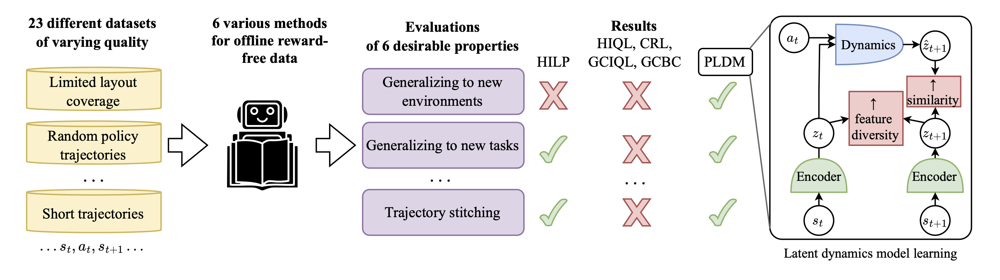

# Overview
This is a repository for the paper ["Learning from Reward-Free Offline Data: A Case for Planning with Latent Dynamics Models"](arxiv.org).

[Website](https://latent-planning.github.io/) [Paper](arxiv.org)

<br/>

In this paper, we focus on methods that can learn from offline trajectories
without reward annotations. We test methods ranging from RL to control, and
find that planning with a learned latent dynamics model (PLDM) is a promising
approach for this setting when the data is imperfect.

# Setting up

## Repo Setup

```
git clone git@github.com:vladisai/PLDM.git

cd PLDM

pip install -r requirements.txt

pip install -e .
```

## Run Experiments

1. Go to `pldm_envs/`, follow instructions to set up dataset for the environment of your hoice
2. Go to `pldm/`, follow instruction to run training or evaluation

## Datasets

To see the datasets we used to train our models, see folders inside `pldm_envs/`.
The readmes there will guide you on how to download and set up the datasets.
